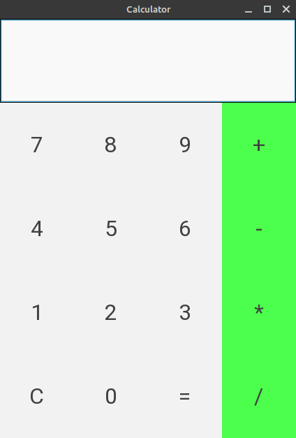

# Kivy Calculator

A Simple Calculator made with kivy framework.Works on all platforms from Windows/linux to android.

## Description

Simple kivy project to help new kivy users build android apps with python.

## Getting Started

### Dependencies

* Python, kivy and buildozer.

### Installing
```
pip install kivy
```
```
pip install buildozer
```


### Executing program

* After installing all the necessary modules.
* open project directory in your IDE and run main.py
* or from your terminal and type: 
```
cd /../../project_files
python3 main.py

```

## Packaging Your App for Android


Create a new folder and navigate to it in your terminal. Once you’re there, you’ll need to run the following command:
```
buildozer init
```
edit buildozer.spec file like app title.
then copy your calculator application into your new folder and rename it to main.py.
and now run
```
buildozer -v android debug
```
first build will take a long time;Buildozer will download whatever Android SDK pieces it needs during the build process.
if build success you will find your apk in bin folder.

